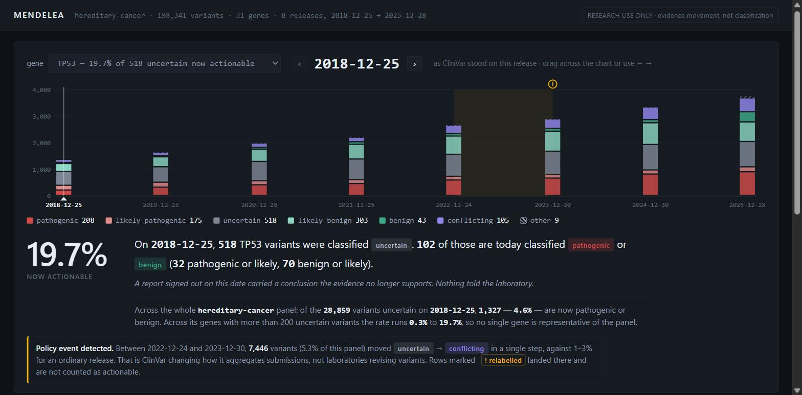
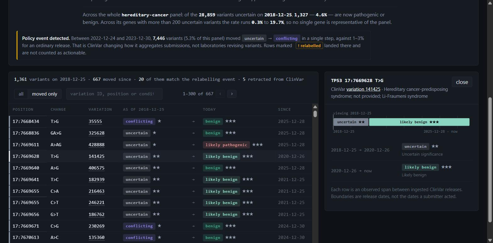
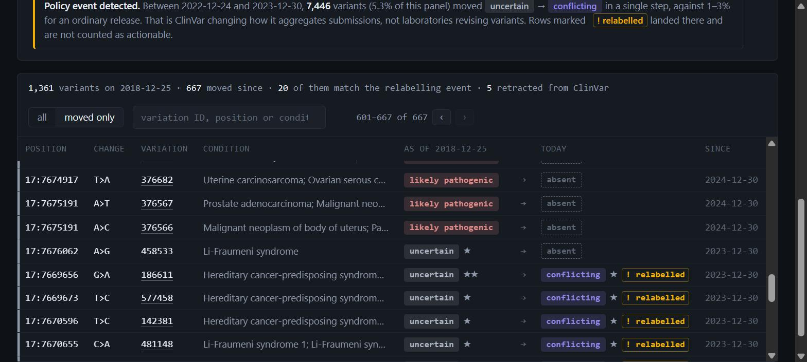

<p align="center">
  
</p>

<h1 align="center">Mendelea</h1>

<p align="center">
  <strong>An evidence timeline for reported genetic variants. It tells a laboratory which of its signed-out results the evidence no longer supports.</strong>
</p>

<p align="center">
  A lab signs out a variant, writes a report, and moves on. Years later the evidence underneath that
  report has changed — submissions accumulate, review status strengthens, classifications flip — and
  nothing tells them. Mendelea reconstructs what the evidence said on any past date and reports what
  has moved since.
</p>

<p align="center">
  <em>It reports that the <strong>evidence</strong> moved. It never asserts a classification.</em>
</p>

<p align="center">
  
  
  
  
  
  
</p>

---

## The problem

Variant classification is not a fact, it is a reading of the evidence available on a date. The
evidence keeps moving; the report does not. A laboratory that signed out a variant of uncertain
significance in 2018 has no mechanism that tells it the same variant is now called pathogenic by an
expert panel.

The reason nobody sells this is that the obvious way to build it does not work. A pipeline that
refreshes "current state" destroys the past every time it runs, so it can answer *what does ClinVar
say today* and never *what did ClinVar say when we signed this out*. Without the second question
there is no product, because the second question is the one that identifies the report to reopen.

**The regulatory position follows from the technical one.** Mendelea reports a documented change in
a public database. It does not interpret, and it does not classify. That is what keeps a
research-use tool on the right side of the line while it is in front of a clinical laboratory.

---

## The evidence that the business exists

Measured on public ClinVar data, before any customer, on a 31-gene hereditary cancer panel across
eight annual releases:

```
  MENDELEA PHASE 0  --  panel 'hereditary-cancer'
  2018-12-25  ->  2025-12-28
  --------------------------------------------------------------
  variants classified at baseline        62,979
  of which VUS                           28,859
  --------------------------------------------------------------
  VUS that moved                         11,560    40.1%
    -> pathogenic / likely pathogenic       518
    -> benign / likely benign               809
    -> conflicting                       10,027
    -> retracted from ClinVar               206
  --------------------------------------------------------------
  POLICY EVENTS DETECTED -- database relabelling, not evidence:
    ! 2022-12-24 -> 2023-12-30: UNCERTAIN -> CONFLICTING 7,446 variants (5.3% of corpus)
  of the moves above, policy-suspect         3,868
  movement rate, policy-adjusted               26.7%  (raw 40.1%)
  --------------------------------------------------------------
  ACTIONABLE movement rate                      4.6%
  Gate: continue if actionable >= 2.0%  [PASS]
```

**The number to quote is 4.6%, never 40%.** The gap between them is the whole reason this is
difficult. Most of that raw movement is variants becoming *conflicting*, which tells a laboratory
nothing it can act on, and 7,446 of those moved in a single release step because ClinVar changed how
it aggregates submissions rather than because anyone revised anything. Reporting that as movement
would send a customer to re-review thousands of cases for nothing, and it would be the last thing
they ever let the tool do.

That attribution is a heuristic on cohort behaviour, not a reading of ClinVar's release notes. The
detector finds a transition sweeping an implausible share of the corpus in one release step and
reports it separately for a human to adjudicate. It never silently discards it, and the actionable
rate excludes `CONFLICTING` entirely, so the number that gets quoted does not depend on the
heuristic being right.

Movement is also concentrated rather than uniform, which means any claim about "how much moves" is
meaningless without naming the gene set:

```
TP53   19.7%      MLH1    8.4%      MSH2   6.9%      MUTYH  4.6%
PTEN   10.2%      BRCA1   8.4%      NF1    6.3%      BRCA2  4.6%
MEN1    8.5%      CDH1    7.1%      VHL    5.3%      POLE   4.9%
```

Both panel figures were verified before being quoted: recomputed straight from the Parquet files
bypassing all span logic, and checked against ClinVar's own API for a sample of expert-panel
variants — which is now [an automated test](tests/test_live_clinvar.py) rather than a note.

---

## Run it

```powershell
python -m venv "$env:USERPROFILE\.venvs\mendelea"
& "$env:USERPROFILE\.venvs\mendelea\Scripts\python.exe" -m pip install -e ".[dev]"
```

```powershell
mendelea ingest --panel hereditary-cancer --from 2018 --to 2026 --per-year 1
mendelea spans  --panel hereditary-cancer     # build the bitemporal timeline
mendelea spike  --panel hereditary-cancer     # the Phase 0 gate, above
mendelea serve  --port 8000                   # the time machine
```

Data lives at `~/mendelea-data` (override with `MENDELEA_DATA_DIR`), deliberately outside any synced
folder — the evidence plane grows to tens of gigabytes and syncing it would compete with your quota
on every rebuild. `ingest` is idempotent and takes an advisory lock per panel, so a second run is
refused rather than allowed to double the load on NCBI.

The customer-facing half, on a synthetic laboratory export:

```powershell
mendelea case-demo   --out demo-cases.csv --count 800
mendelea case-load   --tenant demo-lab --file demo-cases.csv
mendelea case-report --tenant demo-lab
mendelea case-verify --tenant demo-lab        # the decision ledger's hash chain
```

---

## What it looks like

The register is a control surface for high-consequence work, not a dashboard: one deliberate dark
theme, classification colour as a **diverging scale** with uncertain as the neutral midpoint, and
every palette step validated for protanopia, deuteranopia and tritanopia separation against the
surface it is painted on rather than picked by eye. `OTHER` is hatched instead of coloured, because
a second grey cannot be told from the first and a seventh hue would compete with a scale it is not
part of.

### The scrubber is the chart

A bare date slider gives a date and nothing else, so the reader has to move it to discover where
anything happened. This is a stacked column per release, so the shape of the change is visible
before a single click: the uncertain band swelling, the conflicting band appearing, the corpus
growing underneath. The x axis is proportional to time, so a year of silence looks like a year.

The headline it exists to deliver is in the image at the top of this page: **on 2018-12-25, 518 TP53
variants were uncertain, and 102 of them — 19.7% — are today pathogenic or benign.** The panel's own
rate sits directly beneath it, because a gene chosen for being the strongest story is only honest
next to the panel it came from.

### One variant's whole history, beside the diff

Clicking a row opens the span track and every state the variant has held. The table and the pane
divide the work: the table carries the before-and-after for thousands of variants, the pane carries
the full chronology and the raw ClinVar term behind each bucket.

<p align="center">
  
</p>

### The database changing its mind, drawn

Retractions appear as an explicit `absent` state rather than a silent gap, because a variant vanishing
from ClinVar is news to whoever reported it. Rows whose movement matches a detected relabelling
sweep are flagged `! relabelled` and sorted below genuine movement, so a reader can see at a glance
which part of the jump is the database and which part is evidence.

<p align="center">
  
</p>

Every view is a link: gene, release, filters and the open variant live in the URL fragment, so a
specific finding can be pasted into an email and it opens on that variant's history.

---

## How it works

```
src/mendelea/evidence/     the public plane: release discovery, range-queried ingest,
                           normalisation, and the bitemporal span builder
src/mendelea/cases/        one laboratory's reported variants, and the reanalysis report
src/mendelea/decisions/    the append-only, hash-chained review ledger
src/mendelea/reports/      panel movement, and policy-event detection
src/mendelea/web/          queries kept free of transport, behind a stdlib HTTP server
panels/                    gene lists, plus a bundled coordinate cache so a fresh
                           clone ingests the standard panels with no external lookup
```

**Bitemporal, not current state.** Two independent axes: evidence time, when ClinVar asserted
something, and decision time, when the laboratory signed it out. Snapshots are immutable and
content-addressed; the timeline is *derived* from the accumulation, never rebuilt in place. The
payoff is that the product reduces to one query:

```sql
SELECT cv.case_ref, then_.bucket AS at_signout, now_.bucket AS current
FROM   case_variant cv
JOIN   assertion_span then_ ON then_.allele_id = cv.allele_id
       AND then_.valid_from <= cv.reported_on      -- half-open: valid_to is the
       AND then_.valid_to   >  cv.reported_on      -- next span's valid_from
JOIN   assertion_span now_  ON now_.allele_id = cv.allele_id AND now_.is_current
WHERE  then_.bucket IS DISTINCT FROM now_.bucket;
```

If the data model is right the feature is trivial. If it is wrong the feature is impossible.

**Absence is a state.** If an allele present in one release is missing from the next, that is a
retraction and the lab that reported it wants to know. Densifying over the full release grid is what
makes retractions visible instead of silently ending a span.

**Range-queried ingest.** ClinVar publishes a tabix index beside every archived release and NCBI
honours HTTP range requests, so a gene is fetched by pulling only the compressed blocks that contain
it. Pure-Python BGZF and tabix readers, because pysam does not build cleanly on Windows.

```
TP53, one release:  2.6 MB fetched from a 91 MB file  (97.1% saved, verified live)
31 genes, 8 releases:  61 MB against 1.4 GB of whole-file downloads  (23x)
```

**Two runtime dependencies, `duckdb` and `requests`.** DuckDB already read every snapshot in place;
it now writes them too, which retired pyarrow — by an order of magnitude the largest thing the
project installed, and blocked outright by Windows Smart App Control on the machine this is built
on. Every dependency is one more thing that can fail on someone else's laptop.

📐 The full engineering record — left-alignment, the identifier scheme, the ingest internals, and
every number with the check that produced it: [`docs/engineering.md`](docs/engineering.md) ·
Working rules and the decisions that cost real effort to learn: [`CLAUDE.md`](CLAUDE.md)

---

## The business

The product is a **retrospective reanalysis audit** on a laboratory's own back catalogue, then
ongoing monitoring of it. The structural economics are unusual, and they are the reason a very small
team can serve many laboratories:

| | |
|---|---|
| **The expensive plane is public** | `evidence/` is ClinVar, shared by every tenant, tens of GB, ingested once |
| **The private plane is tiny** | `cases/` is about 5 MB per laboratory; ten years of a mid-size lab's reporting is tens of thousands of rows |
| **Marginal cost of a customer** | a few megabytes of storage and one SQL join against a warehouse that already exists |
| **AI inference cost** | **$0.** Every number is a range predicate over a derived table, not a model call |
| **Ingest cost** | 61 MB of network per panel refresh, against 1.4 GB the naive way |

**Not yet modelled, and deliberately not invented here:** pricing, contract value, sales cycle, or
break-even. A tool whose entire pitch is that it does not overstate a number has no business putting
a fabricated one in its own README. The structural claims above are measured; the commercial ones
need customer conversations that have not happened yet.

### Phase gates

Each phase has a gate that is not passed on optimism.

| Phase | Deliverable | Gate | State |
|---|---|---|---|
| **0** | Movement measured on public data, no customer needed | actionable movement ≥ 2% | **passed**, 4.6% and 7.2% on two panels |
| **1** | Evidence timeline, point-in-time queries correct | agreement with ClinVar on hand-checked variants | automated in `test_live_clinvar.py`; density still thin at 8–18 releases |
| **2** | Time-machine demo, public | 10 laboratory conversations booked | **product ready**, conversations are the open item |
| **3** | Case plane, tenant isolation, server-side ledger | first paid retrospective audit delivered | built and tested; unsold |

---

## What a customer gets, and what they hand over

A laboratory supplies coordinates, what it reported, and when. **Nothing else.** No genome, no
phenotype, no identifier, no date of birth. `case_ref` is the laboratory's own pseudonymous key and
we never learn what it points to.

That is a design constraint rather than an MVP shortcut: keeping personal data out means GDPR
Article 9 does not engage, and the security review a hospital runs shrinks to something a small team
can actually answer.

```
  RECONCILIATION   (every input row is accounted for)
    variants loaded                      800
    not found in evidence                  0
    signed out before coverage            47
    examined                             753   94.1%
  ----------------------------------------------------------------
    unchanged since sign-out             509
    moved                                243
      -> pathogenic / likely              22
      -> benign / likely                  12
      -> conflicting                     208   (82 policy-suspect)
      -> retracted from ClinVar            1
  ================================================================
    ACTIONABLE                            34   4.5% of examined
```

**Reconciliation comes before findings, and that ordering is the product.** There are two ways for a
reanalysis report to fail silently, and both look exactly like "nothing changed": the variant is not
in the evidence plane at all, or it was signed out before the earliest snapshot so we cannot say what
the evidence said at the time. Every input row therefore lands in exactly one bucket and the
accounting is printed *first*. Below a 90% match rate the report says so explicitly rather than
letting the movement figures read as representative. A report that quietly drops what it could not
examine tells a customer their back catalogue is clean when in truth it was never looked at.

**Isolation is enforced by reading the source, not by discipline.** The defect that actually occurred
was a query over `case_variant` with no tenant predicate whose docstring claimed to serve one tenant;
a perfectly authenticated caller would have received every laboratory's variants. So
[`tests/test_tenant_isolation.py`](tests/test_tenant_isolation.py) walks the AST of every source file
and fails the build if any SQL naming a tenant-owned table omits `tenant_id`. That generalises in a
way tests do not: it catches queries nobody thought to call.

**Every review is stamped with the evidence it was decided against.** The decision ledger is
append-only and each entry commits to its predecessor, so altering any past entry breaks every hash
after it. It is tamper-evident, not tamper-proof — an actor who can rewrite the whole table can
recompute the whole chain. Per-entry signing needs an identity provider and is Phase 4.

---

## Deploying it

The public demo is **one stateless container holding one read-only file**. No database
service, no volume, no object storage — the web layer never reads a Parquet file, it only
queries DuckDB tables, so the whole deployable artefact is the timeline itself.

```powershell
mendelea export-public --out mendelea-public.duckdb   # ~60 MB, from a 308 MB warehouse
docker build -t mendelea .
docker run --rm -p 8000:8000 mendelea
```

`export-public` copies the evidence tables and nothing else. It leaves behind the build
intermediates, which are four times the size of the timeline they produce, and both private
planes. **A build that does not contain `case_variant`, `decision_ledger` or `tenant_token`
cannot leak them**, whatever the auth layer does, and that is a far easier thing to say to a
hospital's security review than "we checked the queries". A valid token from a real install
gets a 401 against the public build, because the table it would be checked against is not there.

`export-public` ships `assertion_dense` alongside the timeline. It is a build artefact, but the
policy-event detector reads it, and a demo that cannot say which movement was a relabelling is
missing the argument the product turns on.

Fly is configured in [`fly.toml`](fly.toml) — Madrid, scale to zero, TLS terminated at the edge,
health checks against `/health`, which answers 503 rather than a cheerful 200 when the timeline
is missing. Hugging Face Spaces runs the same image but needs `app_port: 8000` in the Space's
`README.md` front matter, since it expects 7860 by default; it is free, sleeps when idle, and
the URL reads as a research demo rather than a product.

Three things the demo needed before it could face the internet, all now in place:

- **A rate limiter.** Every endpoint is read-only, so the risk was never damage, it was cost:
  one `/api/variants` call scans the span table. A token bucket per client, in-process, with the
  client table capped so that rotating source addresses cannot turn the limiter into the memory
  exhaustion it prevents.
- **A cheap health probe.** `/health` asks the database one question rather than building the
  gene ranking and running the policy scan, which is most of a second on a cold process. A probe
  that expensive is the thing that makes a container look unhealthy.
- **Headers that assume hostility.** The page loads no script, style or image from anywhere else,
  so the content security policy says exactly that. Injected markup has nowhere to send anything.

Behind a proxy, set `MENDELEA_TRUSTED_IP_HEADER` to the header that proxy actually sets
(`Fly-Client-IP` on Fly). Unset, the limiter reads the socket, which behind a proxy is one
address for the whole world; trusted blindly, anyone could mint a fresh quota per request.

### Backing it up, and rebuilding from nothing

Nothing under `$MENDELEA_DATA_DIR` is in the repository, and that is correct: it is 369 MB of
data, all of it derived from a public archive. **A bare clone plus a network connection gets
back to a working install in about half an hour**, with no file restored from anywhere:

```powershell
mendelea ingest --panel hereditary-cancer --from 2018 --to 2026 --per-year 1
mendelea spans  --panel hereditary-cancer
mendelea case-demo --out demo-cases.csv --count 800 --seed 7   # the demo tenant, same seed
mendelea case-load --tenant demo-lab --file demo-cases.csv
```

The one thing that does **not** come back identical is the snapshots themselves. They are
content-addressed and immutable by design, and they were written by pyarrow; a re-ingest now
writes them with DuckDB, so the bytes and the `sha256` in every manifest differ even though the
records are the same. The content is reproducible, the artefact is not. If you ever need to
show which exact file a published figure was computed from, that file has to be archived rather
than regenerated:

```powershell
tar -czf evidence-snapshots.tar.gz -C $env:USERPROFILE\mendelea-data evidence
gh release create data-2026-09-15 evidence-snapshots.tar.gz mendelea-public.duckdb `
  --title "Evidence snapshots and public demo warehouse" `
  --notes "31-gene hereditary-cancer panel, 2018-12-25 to 2025-12-28, 8 releases"
```

Releases rather than the repository, because git keeps every version of a binary in full and
forever. Two files are worth the space: the 65 MB of snapshots, which are the system of record,
and the ~60 MB demo warehouse, which saves a re-ingest before a meeting. The 308 MB working
warehouse is not — it rebuilds from the snapshots in about twenty seconds.

(`export-public` reports binary units, as `du` does, while GitHub and your filesystem report
decimal — the same file, about 56 MiB or 59 MB. The exact byte count shifts a little between
exports because DuckDB allocates pages differently each time.)

The genuinely irreplaceable asset is the one this repository has almost none of yet: the
decision ledger. Reviews a laboratory records cannot be recreated from public data, and they are
the reason the ledger is hash-chained rather than a table of notes. Today it holds two demo
entries. Once a real customer's reviews are in it, it stops being a thing you can shrug about
losing, and it is the argument for the managed deployment rather than a laptop.

---

## Verification

```powershell
pytest                      # 266 offline, 6 live deselected
pytest -m network           # the live path: a real ingest, checked against ClinVar's API
mendelea provenance --panel hereditary-cancer   # checksum + reproducibility audit
```

The live tests exist because everything else runs against synthetic snapshots that we wrote
ourselves, which left the part that produces all the data uncovered — `ingest_release` was called by
the CLI and by nothing else. They fetch one real release by byte range, assert the Parquet reads
back with exactly the declared schema, check the manifest checksum against the file, and compare our
buckets against ClinVar's own API for the expert-panel variants that do not drift week to week.

`provenance` answers two different questions and keeps them apart: whether a snapshot still hashes
to what was recorded, and whether the code that produced it can be reconstructed. A snapshot can
pass the first and fail the second.

**Honest state.** Every substantive bug this project has had was found by reading code or running it
on real data, never by the test suite, which was green throughout. The most recent round is typical:
a policy-attribution error that understated real movement fourfold, a table page silently passing for
the whole population, and a CSS comment that swallowed the rule after it — 199 tests green for all
three. Budget for reading, not just testing.

---

## Known limitations

Read these before quoting any number this produces.

- **Identifiers are not VRS-conformant.** The digest construction is GA4GH's; the serialisation is
  not, because true VRS resolves the reference sequence through SeqRepo, a multi-gigabyte dependency.
  They are namespaced `mendelea:VA.` and must not be published as VRS IDs. What is claimed is
  stability, not federation.
- **Policy-event detection is sensitive to snapshot density**, and so is the attribution. At annual
  density the detected event spans a whole year, so a year of ordinary drift is subtracted along with
  the sweep. The 26.7% adjusted figure is a floor; the 36.8% measured against a nine-week window on
  the denser panel is better resolved. The actionable rate is immune to both, which is why it is the
  one quoted.
- **Absence is only meaningful within a panel.** Spans are built per panel over identical gene
  regions. Change the gene list and `ABSENT` transitions become artefacts.
- **Terminology drift is absorbed, not eliminated.** ClinVar renamed `Conflicting_interpretations_of_pathogenicity`
  mid-window; buckets absorb it and a test guards it, but the next rename will need the same treatment.
- **TLS is the platform's job, not the application's.** The server speaks plain HTTP and
  always has. That is fine behind Fly, a Space or any reverse proxy that terminates TLS, and
  it is why `serve` still binds `127.0.0.1` unless you tell it otherwise. Exposing the port
  directly puts the tokens on the wire in the clear.
- **The rate limiter is in-process.** It bounds one container. Several containers behind a
  load balancer each get their own bucket, so the effective limit multiplies by the replica
  count — which is the right trade for a demo and the wrong one for an API under contract.

---

## Who is building this

**Jad Zoghaib** — Lebanese-Venezuelan, based in Barcelona. MSc in Business Analytics from ESADE,
preceded by five years in strategy consulting across the GCC in telecom, energy, healthcare and
FMCG. The last year has been hands-on AI and automation work, including an LLM-based credit
decisioning framework with Banc Sabadell.

The relevant part for this repository is the combination: Mendelea needs someone who can hold a
regulatory position and a commercial argument in one hand and a bitemporal data model in the other,
and it is being built by one person doing both. Working languages: English, Arabic, French, Spanish.

[github.com/jadzoghaib](https://github.com/jadzoghaib) · [linkedin.com/in/jadzoghaib](https://linkedin.com/in/jadzoghaib)

---

<p align="center">
  <sub>Research use only. Not a medical device. Not validated for clinical use.<br>
  It reports that the evidence moved. It never asserts a classification.</sub>
</p>
